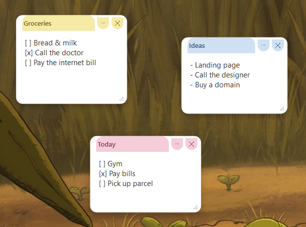
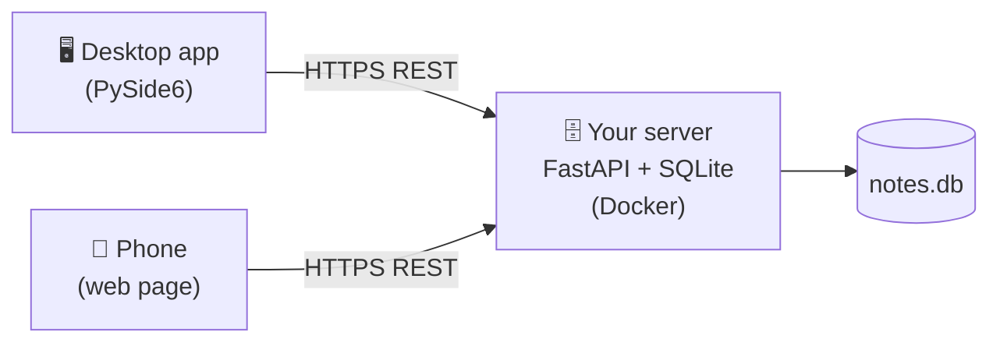

<div align="center">

# 📌 StickySync

**Self‑hosted sticky notes that live on your desktop and sync to your phone.**

Colorful note cards sit right on your Windows desktop. Open a web page on your phone and you see — and edit — the same notes. Everything syncs through *your own* tiny server, so your notes stay yours.



[](LICENSE)


</div>

---

## ✨ Features

- 🖥️ **Desktop cards** — frameless sticky notes on your Windows desktop (PySide6/Qt), draggable and resizable.
- 📱 **Phone access** — a clean mobile web page; add it to your home screen and it works like an app.
- 🔄 **Live sync** — edit on the PC or the phone, changes appear on the other side within seconds.
- ✅ **Checklists & lists** — type `- ` or add a checkbox; `Enter` continues the list, `Tab` indents. Tap a `[ ]` to toggle (on PC *and* phone).
- 🎨 **6 soft pastel colors**, white card body, light header — easy on the eyes.
- 👻 **Opacity** — notes are slightly transparent and become solid when you hover or edit.
- ⏰ **Reminders** — set a date/time; the note pops up and chimes, with a snooze.
- 🔒 **Lock** notes from accidental edits, **duplicate** them, give them a **title**.
- 🔎 **All‑notes window with search** to find any note fast (plus search on the web board).
- 📥 **Tray icon** — hide all to tray, show all, quick settings.
- ⌨️ **Global hotkey** — `Ctrl+Alt+N` creates a note from anywhere.
- 🗑 **Trash** — deleted notes are kept for 30 days and can be restored.
- 🌓 **Dark theme** on the web board (auto + manual toggle).
- 👥 **Accounts** — multi‑user server with registration (can be disabled); each user sees only their notes.
- 🌍 **Bilingual UI** — English / Russian, auto‑detected from your system.
- 🔐 **Your data, your server** — no third‑party cloud, SQLite storage, daily backup script.

## 🧩 How it works



The server is a ~150‑line FastAPI app storing notes in SQLite. The desktop app and the phone page both talk to it over a simple authenticated REST API. You host the server anywhere (a cheap VPS, a home box) — it only needs Docker and HTTPS.

## 🚀 Quick start

### 1. Run the server (Docker)

```bash
git clone https://github.com/DiszaRY/stickysync.git
cd stickysync/server
cp .env.example .env
# edit .env — set STICKERS_PASSWORD (you type this on login)
# and STICKERS_TOKEN (run: openssl rand -hex 32)
docker compose up -d --build
```

The server now listens on `127.0.0.1:8088`. Put it behind a reverse proxy with **HTTPS** (required so the phone can connect and "add to home screen" works). Easiest options:

- **Caddy** — automatic TLS: `notes.example.com { reverse_proxy 127.0.0.1:8088 }`
- **nginx + certbot** — proxy `notes.example.com` → `127.0.0.1:8088`.
- **No domain?** Use [sslip.io](https://sslip.io): a host like `notes.<your-ip>.sslip.io` resolves to your IP, and Let's Encrypt issues a real certificate for it.

### 2. Desktop app (Windows)

**Easiest:** download `StickySync.exe` from the [latest release](https://github.com/DiszaRY/stickysync/releases/latest) and run it — no Python needed.

Or run from source:

```bash
pip install PySide6        # Python 3.10+
pythonw desktop/stickysync.pyw
```

On first run it asks for your **server URL** (e.g. `https://notes.example.com`), **username** and **password**. That's it — your notes appear. Enable *Start with Windows* in Settings to launch it on boot.

### 3. Phone

Open your server URL in the browser, sign in with the password, then **Add to Home Screen**. Done.

## ⌨️ Keyboard shortcuts (desktop)

| Shortcut | Action | | Shortcut | Action |
|---|---|---|---|---|
| `Alt+N` | New note | | `Alt+L` | Lock |
| `Alt+A` | Reminder | | `Alt+M` | Roll up |
| `Alt+D` | Duplicate | | `Alt+F` | All notes / search |
| `Alt+T` | Always on top | | `F2` | Rename |
| `Alt+Del` | Delete | | double‑click header | Roll up |

Right‑click a note's header (or the `⋯` button) for the full menu.

## 🛠️ Tech

- **Desktop:** Python + PySide6 (Qt). Single file, no build step.
- **Server:** FastAPI + Uvicorn + SQLite, in Docker.
- **Phone:** a single static HTML page (vanilla JS), served by the server.

## 🗺️ Roadmap

- Android app (WebView wrapper for the board)
- macOS / Linux desktop builds
- Offline mode for the web board
- Markdown formatting

## 📄 License

[MIT](LICENSE) — do whatever you like. Contributions welcome.

---

<div align="center">

## 🇷🇺 По‑русски

</div>

**StickySync** — стикеры, которые живут на рабочем столе ПК и синхронизируются с телефоном. Цветные карточки прямо на столе Windows; на телефоне открываешь веб‑страницу и видишь/редактируешь те же заметки. Всё синхронизируется через **твой собственный** маленький сервер — данные остаются твоими.

### Возможности
- 🖥️ Стикеры‑карточки на рабочем столе (перетаскивание, изменение размера).
- 📱 Доступ с телефона через веб‑страницу (можно «добавить на главный экран» как приложение).
- 🔄 Живая синхронизация ПК ↔ телефон за пару секунд.
- ✅ Списки и чек‑боксы: `- ` или галочка, `Enter` продолжает список, `Tab` — отступ; клик по `[ ]` отмечает (и на ПК, и на телефоне).
- 🎨 6 мягких пастельных цветов, 👻 прозрачность (чёткие при наведении), ⏰ будильник со звуком, 🔒 блокировка, копия, заголовки, 🔎 окно «Все заметки» с поиском, 📥 трей.
- 🌍 Интерфейс RU/EN (определяется по системе). 🔐 Один пароль, без чужих облаков.

### Быстрый старт
1. **Сервер (Docker):** склонировать репозиторий, в `server/` скопировать `.env.example` → `.env`, задать `STICKERS_PASSWORD` и `STICKERS_TOKEN` (`openssl rand -hex 32`), затем `docker compose up -d --build`. Сервер слушает `127.0.0.1:8088` — поставь перед ним обратный прокси с **HTTPS** (Caddy с авто‑TLS, или nginx+certbot; без домена — через [sslip.io](https://sslip.io)).
2. **ПК:** `pip install PySide6`, запустить `pythonw desktop/stickysync.pyw`. При первом запуске спросит адрес сервера и пароль. В настройках включи «Запускать при старте Windows».
3. **Телефон:** открыть адрес сервера, войти по паролю, «Добавить на главный экран».

### Лицензия
[MIT](LICENSE) — пользуйтесь свободно. Пул‑реквесты приветствуются.
